# easings.h

An easing functions implementation in C++17


# usage

```cpp
// 0 < x < 1
const auto x = 0.5f;
const auto y = Easings::easeInSine<float>(x);
```

# available functions

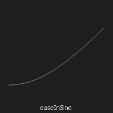
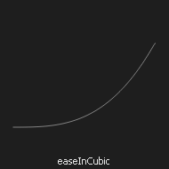
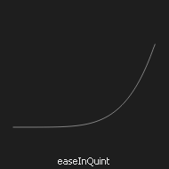
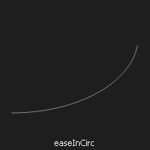
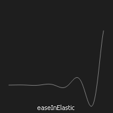
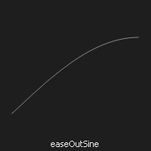
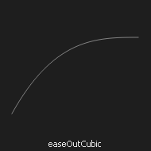
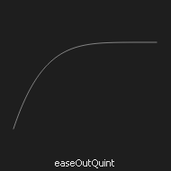
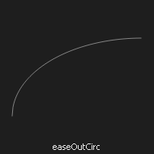
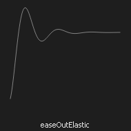
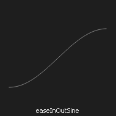
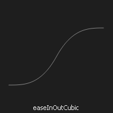
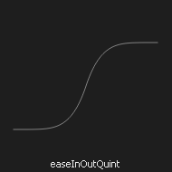
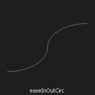
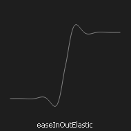
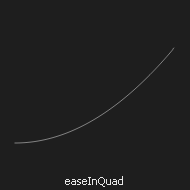
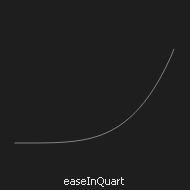
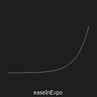
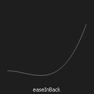
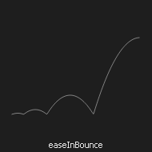
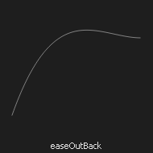
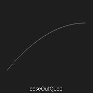
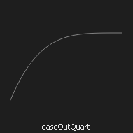
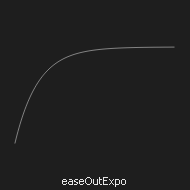
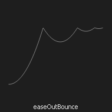
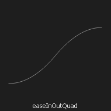
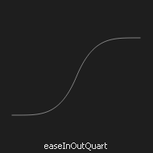
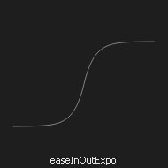
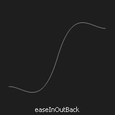
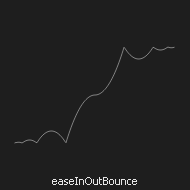


